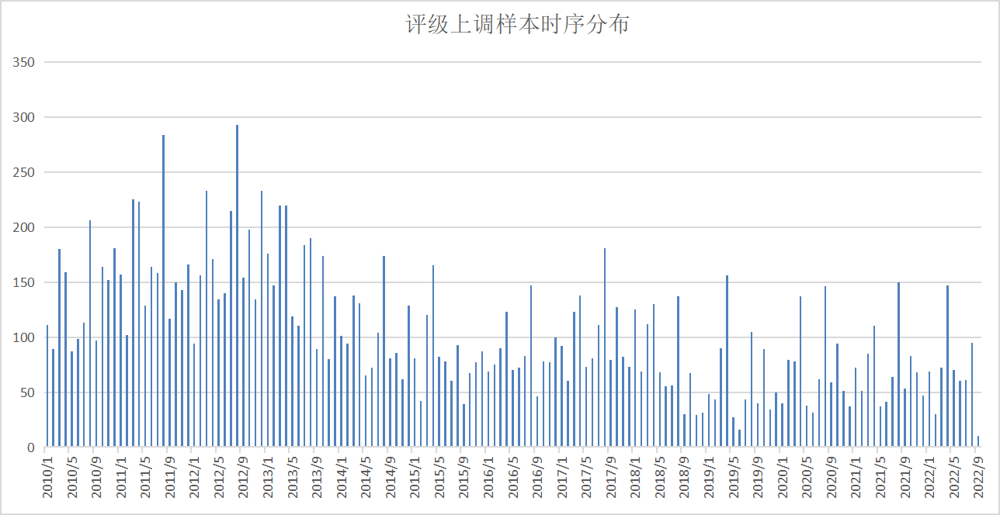
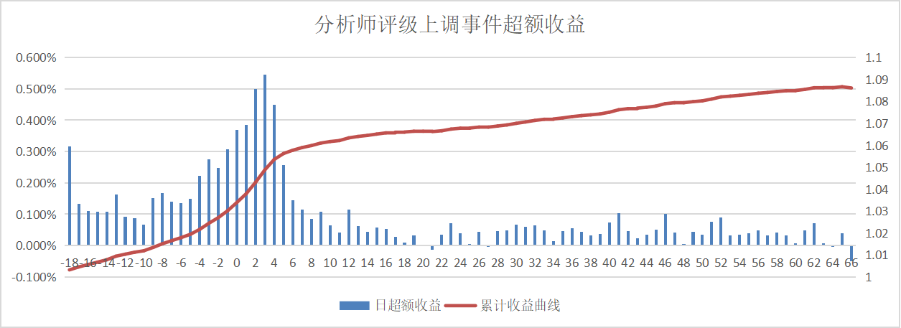
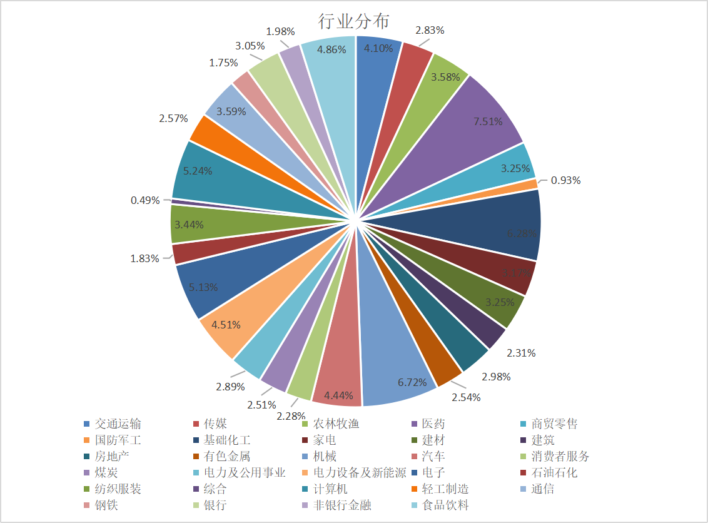

# 投资评级调整事件

## 事件收益

我们定义入库时间差小于 5 天的报告为有效报告，更新时间差在 1 年内的调整数据为有效评级调整。按照如下标准筛选 2010 年以来的投资评级上调样本：
⚫ 数据来源于“个股报告”或“文字评论的预测数据”这两类可信度较高的报告；
⚫ 前序预测和最新预测均来自有效报告，且两次预测间隔小于 1 年；
⚫ 分析师在最新报告中将股票从低投资评级上调至“买入”级别；

每年 3 月、4 月、8 月和 10 月为评级上调事件的高发月份。

记上调评级的日期为 T 日，分析样本在 T-20 日至 T+60 日之间的超额收益走势

| 20日超额 | 40日超额 | 60日超额 |
| :------- | -------- | -------- |
| 3.14%    | 3.98%    | 4.93%    |

评级上调样本的行业分布如下图所示，样本在各行业中的分布较为均匀，接近 90%的行业都有 2%以上的占比，未出现样本集中于部分行业的情形。

